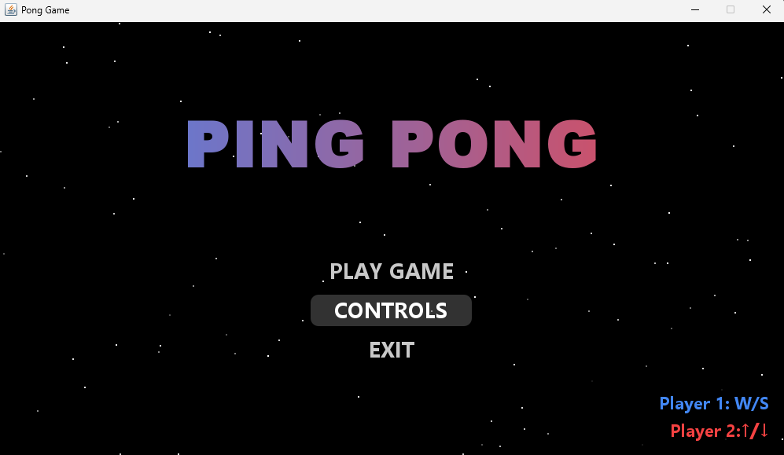
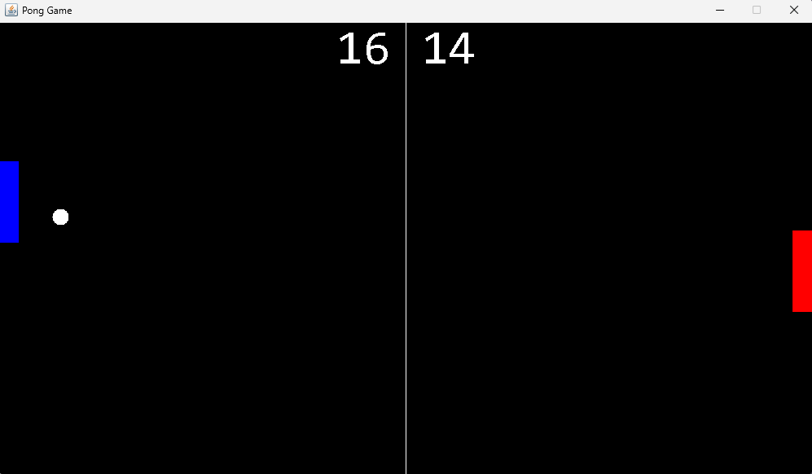

# 🏓 Ping-Pong-Java

A modern implementation of the classic Ping Pong game, developed in Java using the Swing GUI library. This multiplayer version allows two players to compete on the same keyboard with an enhanced gaming experience including sound effects and smooth animations.

### New Version

_Home Screen_


_Gameplay_


### Legacy Version

_Gameplay_


## ✨ Features

- 🎮 Two-player local multiplayer
- 🎵 Dynamic sound effects and background music
- ⭐ Animated background with stars
- 📊 Real-time score tracking
- 🎯 Smooth paddle and ball physics
- ⚡ Responsive controls

## 🎮 Controls

### Player 1 (Left Paddle)

- `W` - Move Up
- `S` - Move Down

### Player 2 (Right Paddle)

- `↑` (Up Arrow) - Move Up
- `↓` (Down Arrow) - Move Down

## 🚀 Getting Started

### Prerequisites

- Java Development Kit (JDK) 8 or higher
- Java Runtime Environment (JRE)

### Installation

1. Clone the repository

```bash
git clone https://github.com/VinayShetyeOfficial/ping-pong-java.git
```

2. Navigate to the project directory

```bash
cd ping-pong-java
```

3. Compile the source code

```bash
javac new-version/PongGame.java
```

4. Run the game

```bash
java new-version.PongGame
```

## 📁 Project Structure

```
ping-pong-java
├── new-version
│  ├── asset
│  │  ├── ball_hit.wav
│  │  ├── ball_bounce.wav
│  │  └── game_music.wav
│  ├── Ball.java
│  ├── GameFrame.java
│  ├── GamePanel.java
│  ├── Paddle.java
│  ├── PongGame.java
│  ├── Score.java
│  └── SoundManager.java
├── old-version
│  ├── Ball.java
│  ├── GameFrame.java
│  ├── GamePanel.java
│  ├── Paddle.java
│  ├── PongGame.java
│  └── Score.java
├── LICENSE
└── README.md
```

## 🛠️ Built With

- Java
- Swing GUI Library
- Java Sound API

## 🎯 Future Improvements

- [ ] Add single-player mode with AI opponent
- [ ] Implement power-ups and special effects
- [ ] Add difficulty levels
- [ ] Create online multiplayer support
- [ ] Add customizable paddle and ball skins

## 🤝 Contributing

Contributions are welcome! Please feel free to submit a Pull Request.

1. Fork the project
2. Create your feature branch (`git checkout -b feature/AmazingFeature`)
3. Commit your changes (`git commit -m 'Add some AmazingFeature'`)
4. Push to the branch (`git push origin feature/AmazingFeature`)
5. Open a Pull Request

## 📝 License

This project is licensed under the [MIT License](./LICENSE) - see the [LICENSE](./LICENSE) file for details.

## 📧 Contact

Vinay Shetye - [GitHub](https://github.com/VinayShetyeOfficial) - vinay.shetye.personal@outlook.com <br>
Project Link: [https://github.com/VinayShetyeOfficial/ping-pong-java](https://github.com/VinayShetyeOfficial/ping-pong-java)
